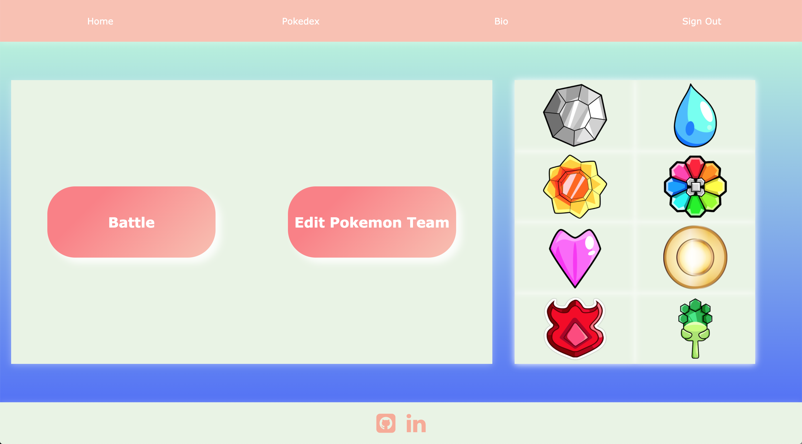
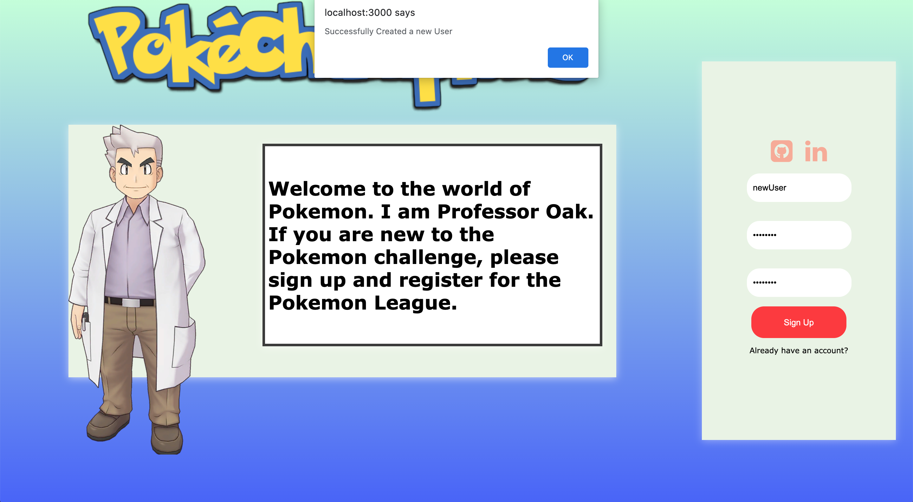
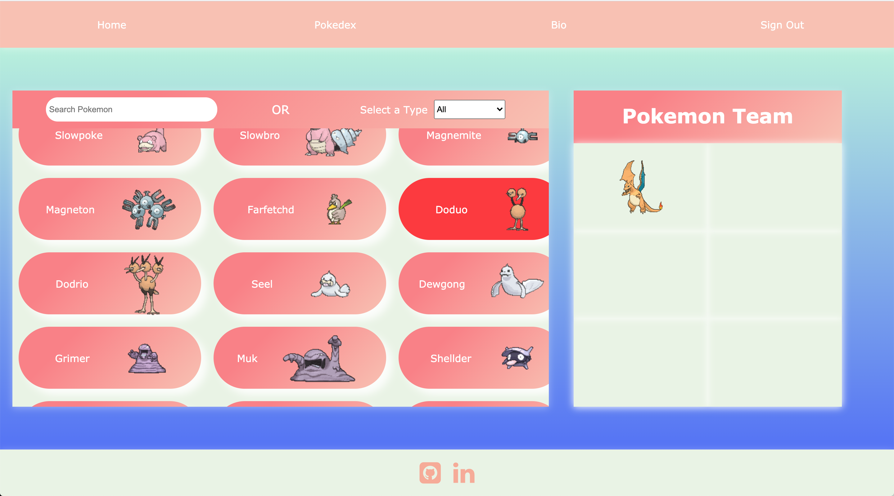
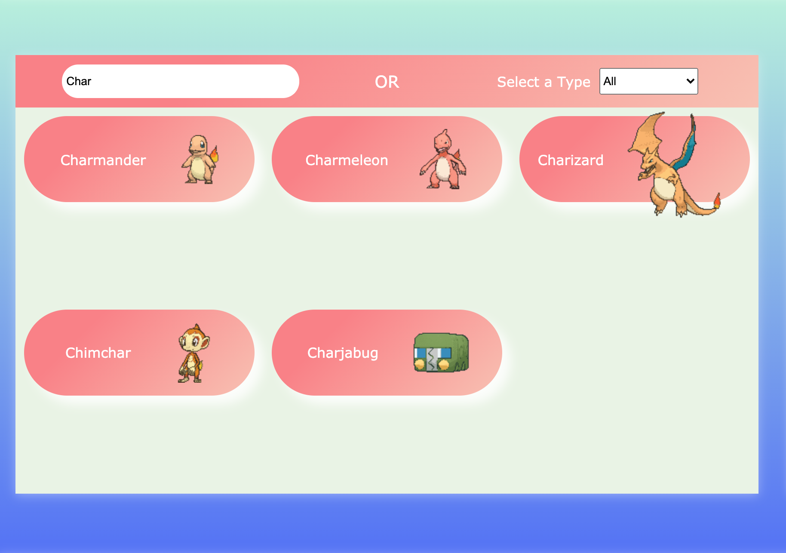
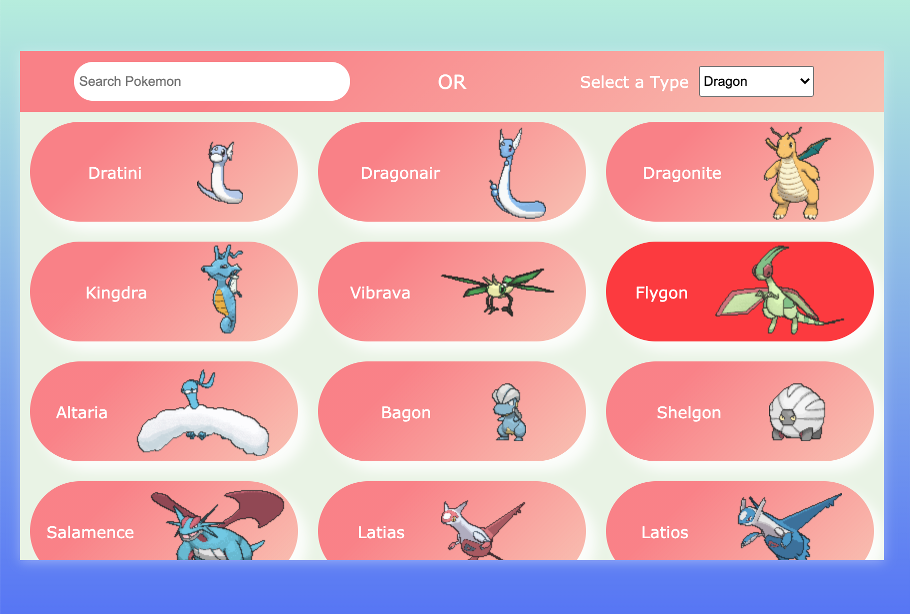
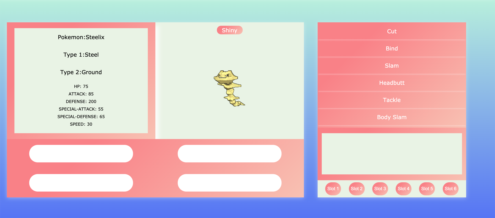
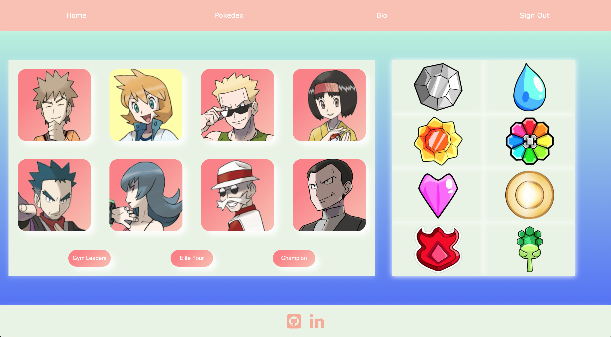

# PokeBattle
An application that allows you to take on the Kanto League in the beautiful world of Pokemon.  Select six of your favorite Pokemon, and challenge the
Gym Leaders, Elite Four, and the Pokemon Champion.

# Live Link
<a href="https://pokechampions.herokuapp.com/">LIVE LINK</a>

# Repo to BackEnd
<a href="https://github.com/rockyboyyang/PokeBattle-BackEnd">LINK TO BACKEND</a>

# Technologies
- Front-end development
    - React
    - CSS
    - HTML
    - JavaScript
  
 - Back-end development
    - Python
    - Flask
    - SQLALchemy
    - SQL
    - Postgres

 # Features
- Landing Page

-Create User Accounts

-Editing your own Pokemon Team

-Search Feature that lets you find a Pokemon by its type or name
   -Search By Name/Characters
   

   -Search By Type
   

-Able to select Shiny and Non-Shiny Pokemon
   - Non-Shiny
   

   - Shiny
   

-Battling Pokemon

-Collect Badges after defeating a Gym Leader

-Have a Pokedex that details all pokemon

# Technical Challenges

### Front-End
- Using Custom CSS
- Implementing modals into pages
- Using React hooks to get the battle sequence to work
- Configuring the damage calculations
- Implementing animations to the sprite when adding to team
- Getting the search feature to work

### Back-end
- Getting the routes configured
- Connecting the database models with Flask
- Authorization/Authentication

# Future Implementations
- Adding more regional Gym Leaders
- Adding Status Moves
- Adding Abilities

